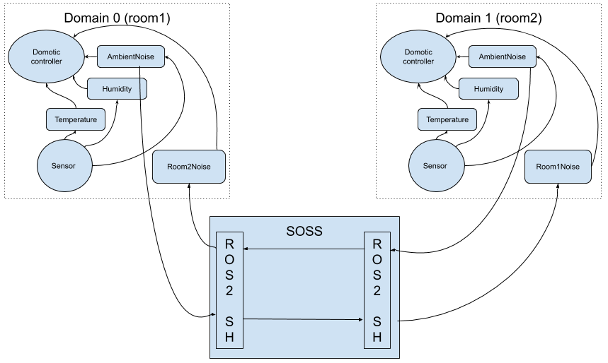

## Use cases

This implementation covers some use cases thanks to its multiple system handles, besides the case of connecting ROS2 with other systems.

With the DDS system handle, ROS2 adquires the capability of connecting to other systems through TCP, as shown in the [DDS system handle documentation][dds-SH].

Another use case for SOSS is domain changing. ROS2 allows to configure different domains in the same network, to give users the possibility of creating separate environments that won’t interfere with each other. A ROS2 node in a certain domain won’t be able to communicate with a node in other domain, even if they are a pair of publisher-subscriber in the same topic in the same LAN. This can be quite useful, but in some cases a user may want to communicate two different domains through a node, to allow only a certain amount of communication between them.



Domain change in SOSS is done using two ROS2 system handles, and is as easy to use as specifying a different domain for each of them. To specify the domain, the system map in the YAML configuration file must have a key-value pair for the domain such as the one seen in the following file:

```YAML
systems:
    room1: { type: ros2, domain: 0, node_name: "soss" }
    room2: { type: ros2, domain: 1, node_name: "soss" }
routes:
    room_1_to_2: { from: room1, to: room2 }
    room_2_to_1: { from: room2, to: room1 }
topics:
    Room1Noise: { type: "std_msgs/Float", route: room_1_to_2, remap: { room1: “AmbientNoise” }}
    Room2Noise: { type: "std_msgs/Float", route: room_2_to_1, remap: { room2: “AmbientNoise” }}
```

Notice that SOSS also includes a functionality to remap topic names, as seen in its documentation.
Initializing a SOSS instance with this YAML file will mirror the ambient noise topic from one room to the other, while leaving the rest of the topics independent even if they have the same topic name and data type.

[dds-SH]: https://github.com/eProsima/SOSS-DDS
